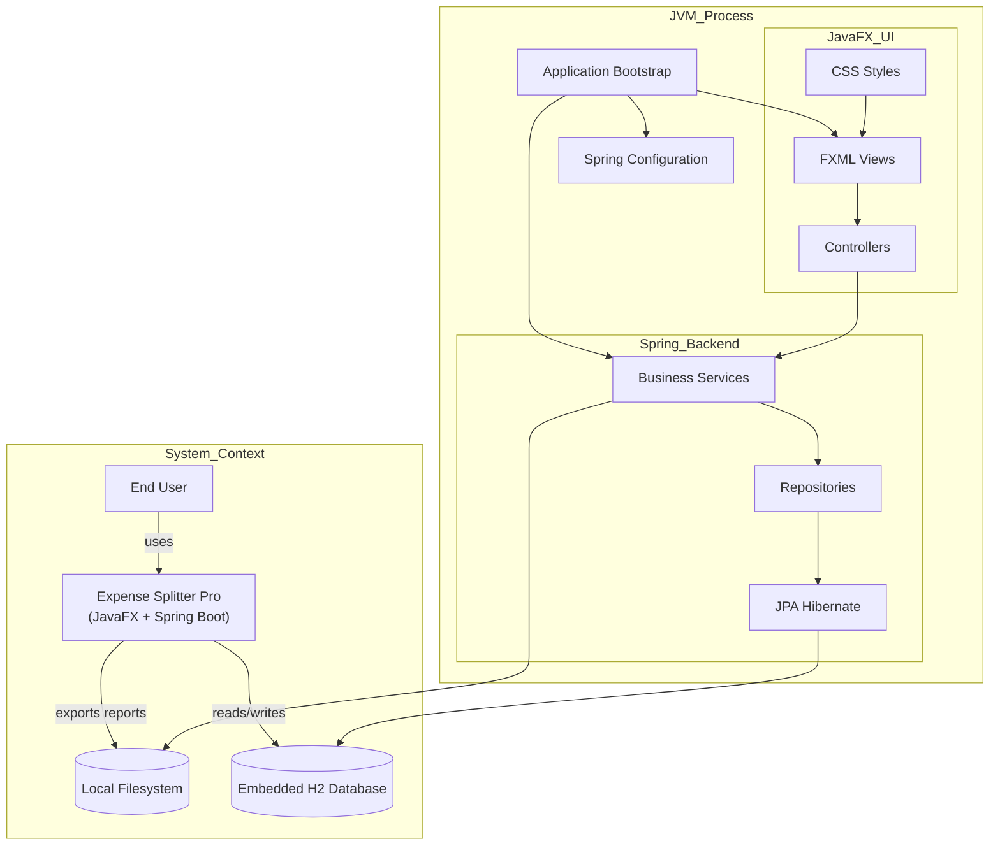
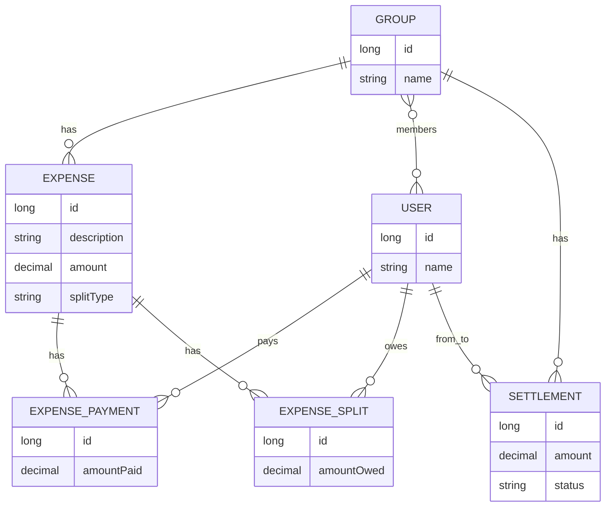
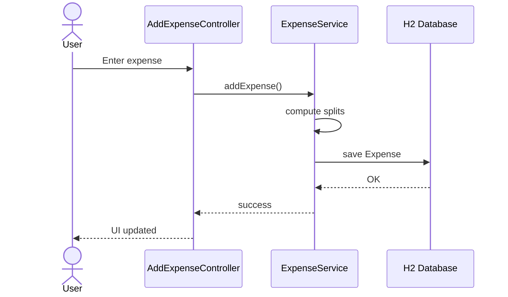
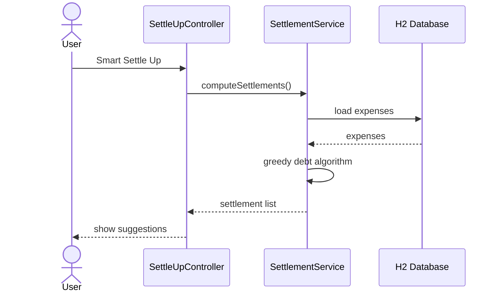
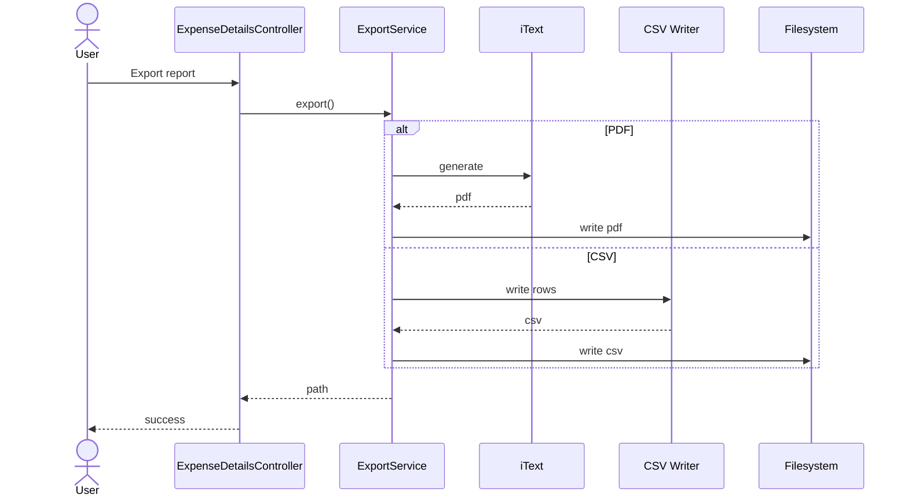

# 💸 Expense Splitter Pro

[](https://openjdk.org/)
[](https://spring.io/projects/spring-boot)
[](https://openjfx.io/)
[](https://opensource.org/licenses/MIT)

**Expense Splitter Pro** is a sophisticated desktop application designed to take the headache out of group finances. Whether it's a weekend trip, a shared apartment, or a dinner with friends, this tool ensures everyone pays their fair share with minimal friction.

---

# ✨ Key Features

### 👥 Effortless Group Management
Organize your social circles. Create custom groups for different occasions and manage members seamlessly.

### 💰 Smart Expense Tracking
Log expenses as they happen with flexible split types:

- **Equal**
- **Exact Amount**
- **Percentage**
- **Shares**

### 💳 Multiple Payer Support
A single expense can be split among multiple payers.

Example:  
3 friends split a hotel bill but 2 people paid.

The system records **who paid and who owes** correctly.

### 📉 Debt Simplification Algorithm
Our **Smart Settle Up** feature uses a **greedy optimization algorithm** to minimize the number of transactions needed to settle all debts.

### 📄 Professional Export Options
Generate detailed reports:

- **PDF Reports (iText)**
- **CSV Data Export**

### 🎨 Premium UI/UX
Built with **JavaFX + AtlantaFX (Primer Dark)** for a modern dark-mode experience.

### 💾 Robust Persistence
Uses **Spring Data JPA with an embedded H2 database** for reliable local storage.

---

# 🛠️ Tech Stack

| Layer | Technology |
|------|-------------|
| Core Framework | Spring Boot 3 |
| UI Framework | JavaFX 21 + FXML |
| Styling | AtlantaFX |
| Persistence | Spring Data JPA / Hibernate |
| Database | H2 Embedded Database |
| PDF Generation | iText PDF Core |
| Data Export | CSV Writer |
| Build Tool | Maven |

---

# 🚀 Getting Started

## Prerequisites

- **Java JDK 17+**
- **Maven 3.6+**

---

## Installation

### Clone the Repository

```bash
git clone https://github.com/malcolm-cephas/Expense_Splitter.git
cd Expense_Splitter/expense-splitter
```

### Build the Project

```bash
mvn clean install -DskipTests
```

### Run the Application

```bash
mvn javafx:run
```

---

# 🧩 System Architecture

The application runs as a **single JVM desktop application** combining **JavaFX UI** with a **Spring Boot backend**.

## High Level Architecture



---

# 🗄️ Database Model

The application uses an **embedded relational model**.



---

# 🔄 Application Flow

## Adding an Expense



---

## Smart Settle Up Algorithm



---

## Export Reports



---

# 📂 Project Structure

```
src/main/java/com/malcolm/expensesplitter
│
├── controllers
│   ├── DashboardController
│   ├── GroupViewController
│   ├── AddExpenseController
│   ├── ExpenseDetailsController
│   ├── SettleUpController
│   └── StatisticsController
│
├── services
│   ├── ExpenseService
│   ├── SettlementService
│   ├── ExportService
│   └── GroupService
│
├── repositories
│   ├── GroupRepository
│   ├── UserRepository
│   ├── ExpenseRepository
│   ├── ExpensePaymentRepository
│   ├── ExpenseSplitRepository
│   └── SettlementRepository
│
└── models
    ├── Group
    ├── User
    ├── Expense
    ├── ExpensePayment
    ├── ExpenseSplit
    ├── Settlement
    ├── SplitType
    └── SettlementStatus
```

---

# 🤝 Contributing

Contributions are welcome!

1. Fork the repository
2. Create a feature branch

```
git checkout -b feature/AmazingFeature
```

3. Commit your changes

```
git commit -m "Add AmazingFeature"
```

4. Push to your branch

```
git push origin feature/AmazingFeature
```

5. Open a Pull Request

---

# 📄 License

This project is licensed under the **MIT License**.

See the [LICENSE](LICENSE) file for details.

---

# 👨‍💻 Author

*Malcolm Cephas*
- GitHub: [@malcolm-cephas](https://github.com/malcolm-cephas)
