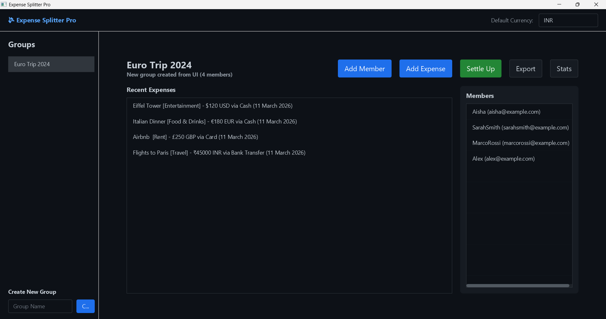
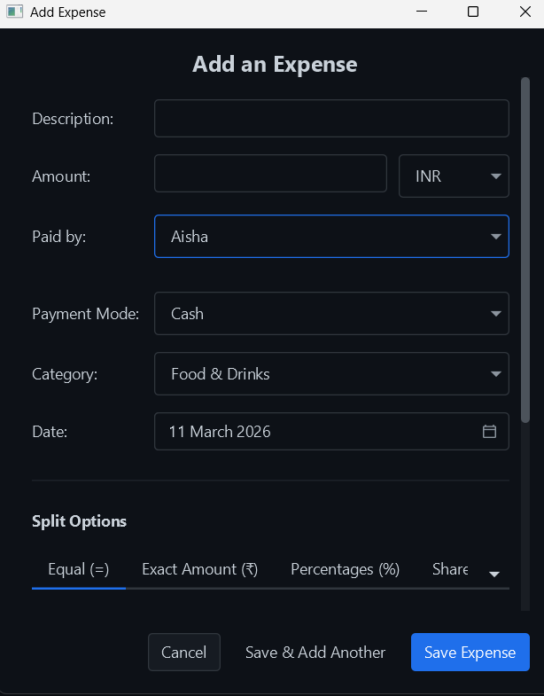
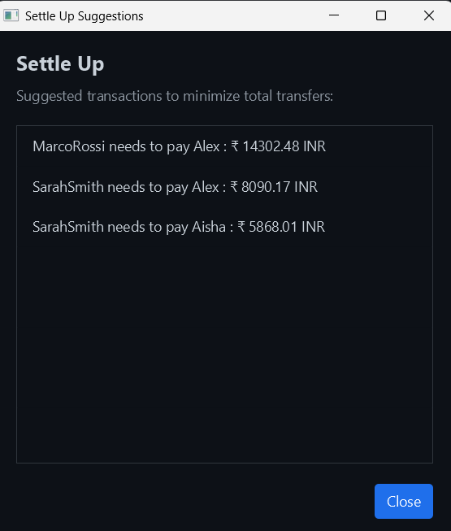
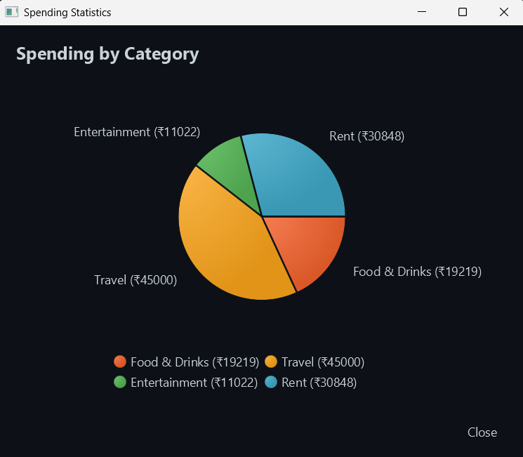
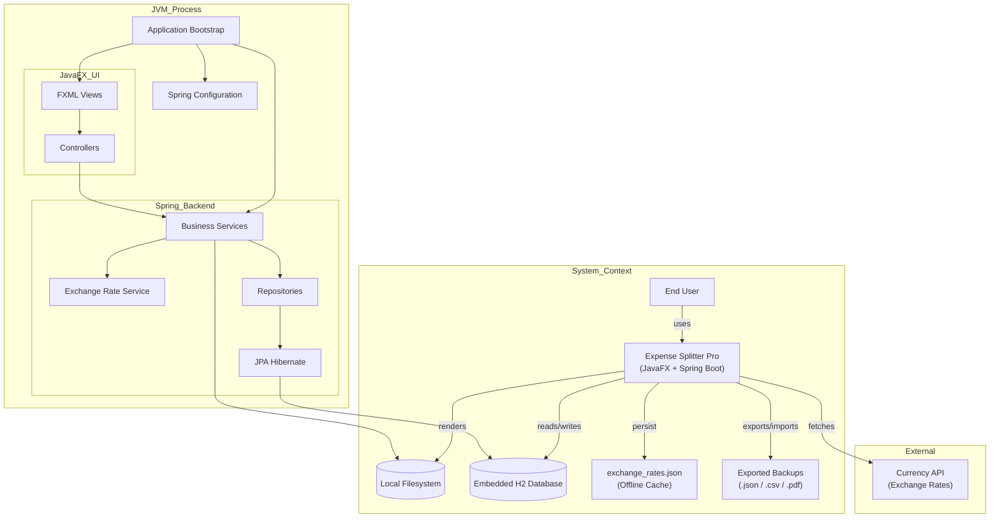
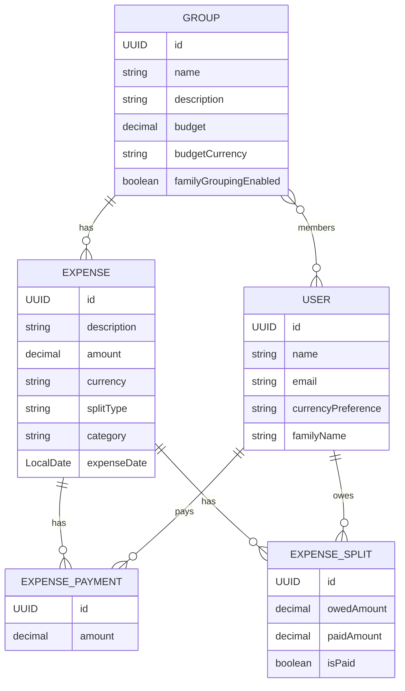
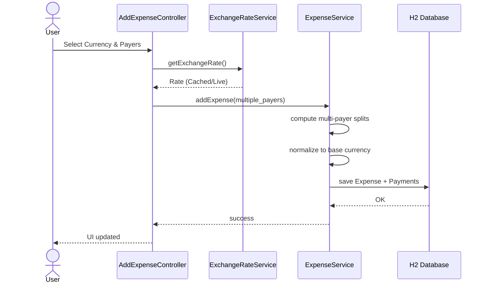
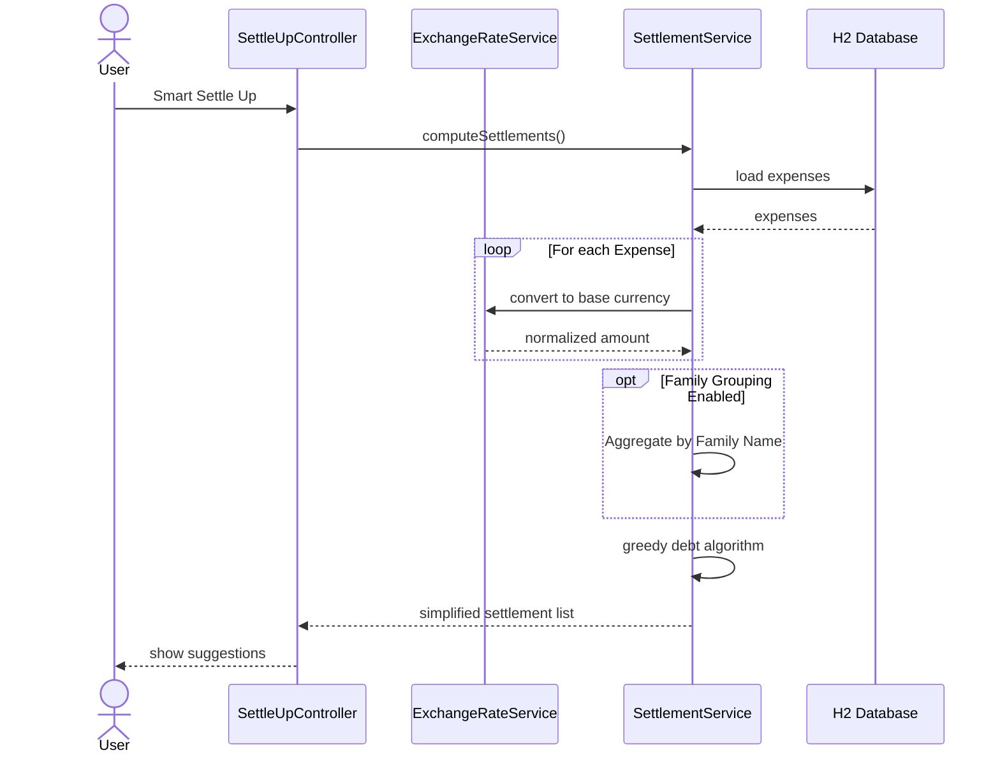
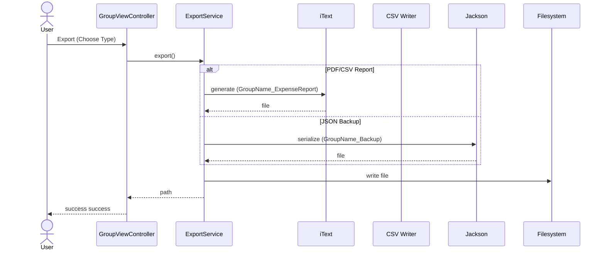

# 💸 Expense Splitter Pro

[](https://openjdk.org/)
[](https://spring.io/projects/spring-boot)
[](https://openjfx.io/)
[](https://opensource.org/licenses/MIT)

**Expense Splitter Pro** is a sophisticated desktop application designed to take the headache out of group finances. Whether it's a weekend trip, a shared apartment, or a dinner with friends, this tool ensures everyone pays their fair share with minimal friction.

---

# 📸 Screenshots

<p align="center">
  
  </p>
<p align="center">
  
  
  
</p>

---

# 📄 Sample Reports

Experience the precision of our multicurrency reporting with these sample exports from an international trip:

- 🇪🇺 [Euro Trip 2024 - Euro Report](assets/Euro_Trip_2024_Euro_Report.pdf)
- 🇮🇳 [Euro Trip 2024 - INR Report](assets/Euro_Trip_2024_INR_Report.pdf)
- 🇺🇸 [Euro Trip 2024 - USD Report](assets/Euro_Trip_2024_USD_Report.pdf)

---

# ✨ Key Features

### 👥 Effortless Group Management
Organize your social circles. Create custom groups for different occasions and manage members seamlessly with automatic user profile setup.

### 💰 Smart Expense Tracking
Log expenses as they happen with flexible split types:
- **Equal**
- **Exact Amount**
- **Percentage**
- **Shares**

### 🌍 Multi-Currency Support
Record expenses in any currency (INR, USD, EUR, etc.) and let the app handle the math.
- **Smart Currency Selection**: A powerful searchable modal allows you to pick from 100+ global currencies by name or country.
- **Advanced Financial Formatting**: Automatically applies Western, Indian (3-2), or East Asian (Myriad) digit grouping based on the currency.
- **Live Exchange Rates**: Real-time conversion using the [Currency API](https://github.com/fawazahmed0/exchange-api).
- **Persistent Offline Cache**: Rates and currency metadata are cached locally (`exchange_rates.json`, `currency_names.json`) for seamless offline operation.
- **Global Normalization**: All statistics and settlements are automatically normalized to your primary currency.

### 💳 Multiple Payer Support
A single expense can be split among multiple payers. The system tracks partial payments and contributions meticulously.

### 📉 Debt Simplification Algorithm
Our **Smart Settle Up** feature uses a **greedy optimization algorithm** to minimize the number of transactions needed to settle all debts across multiple currencies.

### 📄 Professional Export Options
Generate detailed reports with smart naming:
- **PDF Reports (iText)**: Styled summaries with charts. (Default: `GroupName_ExpenseReport`)
- **CSV Data Export**: Raw transaction data for Excel/Sheets. (Default: `GroupName_ExpenseReport`)
- **JSON Backup**: Full database portable export for migration. (Default: `GroupName_Backup`)

### 👨‍👩‍👧‍👦 Family Grouping
Enable family-based expense tracking to aggregate spending by household while maintaining individual member records.

### 🎨 Premium UI/UX
Built with **JavaFX + AtlantaFX (Primer Dark)** for a modern dark-mode experience.

### 💾 Robust Persistence
Uses **Spring Data JPA with an embedded H2 database** for reliable local storage and automatic data migration.

---

# 🛠️ Tech Stack

| Layer | Technology |
|------|-------------|
| Core Framework | Spring Boot 3 |
| UI Framework | JavaFX 21 + FXML |
| Styling | AtlantaFX |
| Persistence | Spring Data JPA / Hibernate |
| Database | H2 Embedded Database |
| JSON Processing | Jackson Databind |
| PDF Generation | iText PDF Core |
| Data Export | CSV Writer |
| Build Tool | Maven |

---

# 🚀 Getting Started

## Prerequisites

- **Java JDK 17+**
- **Maven 3.6+**

---

## Installation

### Clone the Repository

```bash
git clone https://github.com/malcolm-cephas/Expense_Splitter.git
cd Expense_Splitter/expense-splitter
```

### Quick Start (Windows)
To set up the environment and build the project for the first time:
```bash
./setup.bat
```

Once setup is complete, run the application:
```bash
./start.bat
```

> [!NOTE]
> Detailed system dependencies are listed in [requirements.txt](requirements.txt).

## 👷 CI/CD & Deployment
The project includes a robust GitHub Actions workflow ([build.yml](.github/workflows/build.yml)) that:
- Automatically builds and tests the application on every push to `main`.
- Generates an executable JAR as a build artifact.
- Enables seamless release management via GitHub Releases.

### Build the Project manually
```bash
mvn clean install -DskipTests
mvn javafx:run
```

---

# 🧩 System Architecture

The application runs as a **single JVM desktop application** combining **JavaFX UI** with a **Spring Boot backend** and external **Currency API** integration.

## High Level Architecture



---

# 🗄️ Database Model

The application uses an **embedded relational model** with support for currency preferences.



---

# � Application Flow

## Adding an Expense
The app fetches live rates (or uses cache) to ensure correct conversion if the expense currency differs from the group base.



---

## Smart Settle Up Algorithm
Debts are simplified globally by converting all individual expense balances into the user's primary currency first.



---

## Export Reports
Generate reports that preserve both the original currency and the normalized totals.



---

# �📂 Project Structure

```
src/main/java/com/malcolm/expensesplitter
│
├── config
│   └── AppConfig (Global Settings & Currency Symbols)
│
├── controllers
│   ├── DashboardController (Setup & Navigation)
│   ├── GroupViewController (Expense List)
│   ├── AddExpenseController (Multi-Currency Entry)
│   ├── ExpenseDetailsController (Split Breakdown)
│   └── StatisticsController (Normalized spending charts)
│
├── services
│   ├── ExpenseService (Split Logic)
│   ├── SettlementService (Debt Simplification)
│   ├── ExchangeRateService (API & Offline Cache)
│   └── ExportService (PDF/CSV Generation)
│
├── repositories
│   └── ... (JPA Data Access)
│
└── models
    └── ... (Domain Entities)
```

---

# 🤝 Contributing

Contributions are welcome!

1. Fork the repository
2. Create a feature branch
3. Commit your changes
4. Push to your branch
5. Open a Pull Request

---

# 📄 License

This project is licensed under the **MIT License**.
See the [LICENSE](LICENSE) file for details.

---

# 👨‍💻 Author

*Malcolm Cephas*
- GitHub: [@malcolm-cephas](https://github.com/malcolm-cephas)

---
