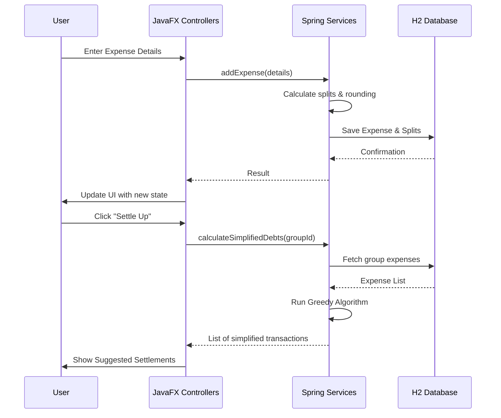

# 💸 Expense Splitter Pro

[](https://openjdk.org/)
[](https://spring.io/projects/spring-boot)
[](https://openjfx.io/)
[](https://opensource.org/licenses/MIT)

**Expense Splitter Pro** is a sophisticated desktop application designed to take the headache out of group finances. Whether it's a weekend trip, a shared apartment, or a dinner with friends, this tool ensures everyone pays their fair share with minimal friction.

---

## ✨ Key Features

- **👥 Effortless Group Management**: Organize your social circles. Create custom groups for different occasions and manage members seamlessly.
- **💰 Smart Expense Tracking**: Log expenses as they happen. Supports multiple split types: **Equal**, **Exact Amount**, **Percentage**, and **Shares**.
- **💳 Multiple Payer Support**: A single expense can now be split among multiple payers. Perfect for situations where a few friends chip in for a large bill. Select "Multiple Payers..." in the dropdown to enter specific payment amounts for each person.
- **📉 Debt Simplification Algorithm**: Our "Smart Settle Up" feature uses a greedy optimization algorithm with a contribution-based balance model to calculate the *minimum* number of transactions required to clear all debts.
- **📄 Professional Export options**: Export comprehensive group reports in **PDF** and **CSV** formats. Reports correctly reflect multi-payer contributions and individual shares.
- **🎨 Premium UI/UX**: Built with **JavaFX** and styled with the **AtlantaFX** (Primer Dark) theme for a sleek, modern, and dark-mode-first experience.
- **💾 Robust Persistence**: Uses **Spring Data JPA** with an embedded **H2** database. Includes a compatibility layer for schema migrations during updates.

---

## 🛠️ Tech Stack

- **Core Framework**: Spring Boot 3.2.3 (Dependency Injection, Transactions, JPA)
- **Frontend**: JavaFX 21 + FXML (Native Desktop Experience)
- **Styling**: AtlantaFX (Modern CSS Framework for JavaFX)
- **PDF Generation**: iText PDF Core 8
- **Database**: H2 (Embedded SQL Database)
- **Persistence**: Spring Data JPA / Hibernate
- **Build Tool**: Maven

---

## 🚀 Getting Started

### Prerequisites

- **Java JDK 17** or higher
- **Maven 3.6+**

### Installation & Execution

1. **Clone the Repository**
   ```bash
   git clone https://github.com/malcolm-cephas/Expense_Splitter.git
   cd Expense_Splitter/expense-splitter
   ```

2. **Build the Project**
   ```bash
   mvn clean install -DskipTests
   ```

3. **Run the Application**
   ```bash
   mvn javafx:run
   ```

---

## 🧩 Architecture & Implementation Details

### 🔄 Application Flow


### Project Structure
- **`com.malcolm.expensesplitter.controllers`**: JavaFX controllers handling UI logic and user events.
- **`com.malcolm.expensesplitter.services`**: Core business logic.
    - `SettlementService`: Implements the greedy debt simplification algorithm.
    - `ExportService`: Handles the generation of PDF (via iText) and CSV reports.
    - `ExpenseService`: Manages complex split calculations and transactional integrity.
- **`com.malcolm.expensesplitter.models`**: JPA entities (Group, User, Expense, ExpenseSplit).
- **`com.malcolm.expensesplitter.repositories`**: Data access layer using Spring Data JPA.

### 🧠 Debt Simplification Algorithm
The application minimizes the number of transactions using a greedy approach:
1.  Calculate the net balance of every user using the formula: `Balance = Σ(Payments Contributed) - Σ(Individual Shares Owed)`.
2.  Identify **Debtors** (Negative balance) and **Creditors** (Positive balance).
3.  Store them in two Max-Priority Queues.
4.  Pair the largest debtor with the largest creditor to settle the maximum possible amount in a single transaction.
5.  Repeat until all balances are settled.

---

## 🤝 Contributing

Contributions are welcome! If you have suggestions for improvement or want to add new features:
1.  Fork the Project
2.  Create your Feature Branch (`git checkout -b feature/AmazingFeature`)
3.  Commit your Changes (`git commit -m 'Add some AmazingFeature'`)
4.  Push to the Branch (`git push origin feature/AmazingFeature`)
5.  Open a Pull Request

## 📄 License

This project is licensed under the MIT License - see the [LICENSE](LICENSE) file for details.

---
*Developed by Malcolm*

